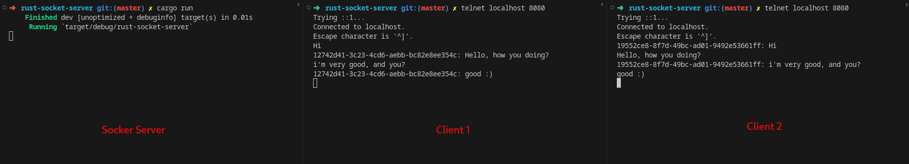

# Rust Socket Server

This application is an example of how to implement a socket server using Rust with the Tokio library.



## Requirements

- Rust (>=1.66.0)

## How to execute

Open a terminal to run the server

```bash
cargo run
```

Open two additional terminals to act as "Client 1" and "Client 2" to connect to the server.

```bash
telnet localhost 8080
```

Now, in the terminal of "Client 1," type a message and observe how it appears in the "Client 2" terminal. Similarly, you can try sending messages from "Client 2" and see them displayed in "Client 1" terminal.
